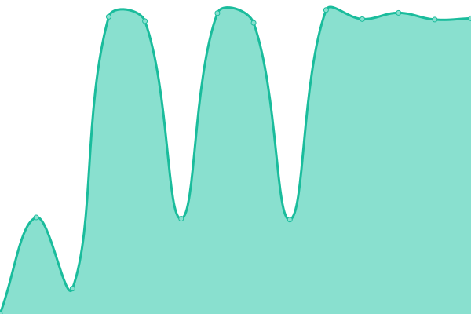

# [📈 Live Status](https://github-uptime.asar.studio): <!--live status--> **🟩 All systems operational**

This repository contains the open-source uptime monitor and status page for [Asar Studio](https://github-uptime.asar.studio), powered by [Upptime](https://github.com/upptime/upptime).

With [Upptime](https://upptime.js.org), you can get your own unlimited and free uptime monitor and status page, powered entirely by a GitHub repository. We use [Issues](https://github.com/asar-studio/upptime/issues) as incident reports, [Actions](https://github.com/asar-studio/upptime/actions) as uptime monitors, and [Pages](https://github-uptime.asar.studio) for the status page.

<!--start: status pages-->
<!-- This summary is generated by Upptime (https://github.com/upptime/upptime) -->
<!-- Do not edit this manually, your changes will be overwritten -->
<!-- prettier-ignore -->
| URL | Status | History | Response Time | Uptime |
| --- | ------ | ------- | ------------- | ------ |
|  [RUSDRAM](https://rusdram.org/) | 🟩 Up | [rusdram.yml](https://github.com/asar-studio/uptime/commits/master/history/rusdram.yml) | 

 1872ms
     
 | 

<a href="https://asar-studio.github.io/uptime/history/rusdram">96.19%</a>
    

|  [Leon Hotel](https://leonhotel.net/) | 🟩 Up | [leon-hotel.yml](https://github.com/asar-studio/uptime/commits/master/history/leon-hotel.yml) | 

 1290ms
     
 | 

<a href="https://asar-studio.github.io/uptime/history/leon-hotel">96.33%</a>
    

|  [VISIT-ABKHAZIA](https://visit-abkhazia.ru/) | 🟩 Up | [visit-abkhazia.yml](https://github.com/asar-studio/uptime/commits/master/history/visit-abkhazia.yml) | 

 3445ms
     
 | 

<a href="https://asar-studio.github.io/uptime/history/visit-abkhazia">85.05%</a>
    

|  [Dev Server](https://rusdram-client.asar.studio/) | 🟩 Up | [dev-server.yml](https://github.com/asar-studio/uptime/commits/master/history/dev-server.yml) | 

 5291ms
     
 | 

<a href="https://asar-studio.github.io/uptime/history/dev-server">73.47%</a>
    

<!--end: status pages-->

[**Visit our status website →**](https://github-uptime.asar.studio)

## 📄 License

- Powered by: [Upptime](https://github.com/upptime/upptime)
- Code: [MIT](./LICENSE) © [Asar Studio](https://github-uptime.asar.studio)
- Data in the `./history` directory: [Open Database License](https://opendatacommons.org/licenses/odbl/1-0/)
